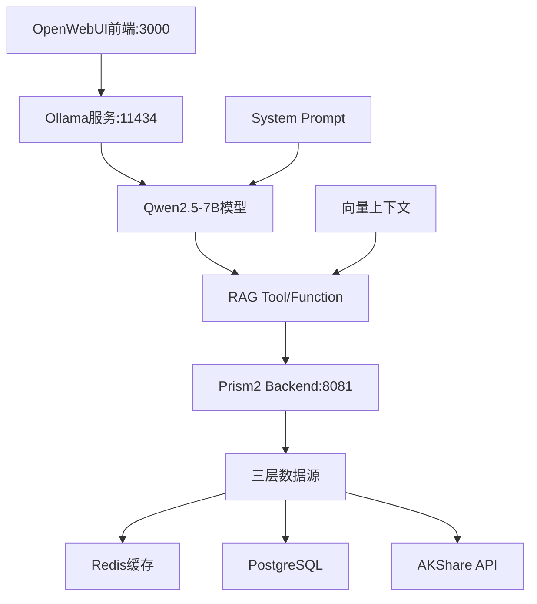

# RAG + OpenWebUI 集成开发计划

> **项目目标**: 集成AI智能财经评论员功能，通过OpenWebUI前端调用Qwen2.5模型，配合RAG Tool获取实时股票数据和分析上下文

## 📋 基本目的

### 核心功能
- **智能问答**: 用户输入"海立股份怎么样？"、"600619评价"等自然语言查询
- **多源数据融合**: 实时K线数据 + 结构化财报信息 + RAG历史上下文
- **专业分析**: 基于预设System Prompt，模拟专业财经评论员提供投资建议
- **本地化部署**: 完全离线运行，保护用户隐私和数据安全

### 用户交互流程
```
用户查询 → OpenWebUI界面 → Ollama(Qwen2.5) → RAG Tool调用 → Prism2 Backend API → 三层数据融合 → 专业分析回答
```

## 🏗️ 基础设计

### 系统架构图


### 技术栈选择
- **AI层**: Ollama + Qwen2.5-7B-Instruct (中文金融优化)
- **前端**: OpenWebUI (成熟的LLM管理界面)
- **工具层**: Custom RAG Tool (Python Function调用)
- **数据层**: 现有Prism2 Backend API (已验证工作正常)

## 📊 基本软件配置

### 端口分配 (严格遵循01-固定接口规范.md)
| 服务 | 端口 | 协议 | 用途 | 状态 |
|------|------|------|------|------|
| OpenWebUI | 3000 | HTTP | AI聊天界面 | **新增** |
| Ollama | 11434 | HTTP | LLM服务 | **新增** |
| Prism2 Backend | 8081 | HTTP | 数据API (已存在) | 保持 |
| PostgreSQL | 5432 | TCP | 数据库 | 保持 |
| Redis | 6379 | TCP | 缓存 | 保持 |

### 环境要求确认
- **内存**: 7.6GB可用 → **充足** (Qwen2.5-7B需要4-5GB)
- **硬盘**: 929GB可用 → **充足** (模型约7GB)
- **CPU**: Intel i5-1135G7 8核 → **适合** (CPU推理)
- **GPU**: 无 → **使用CPU推理模式**

## 🔧 与既存功能的集成方式

### 1. API接口复用
```bash
# 完全复用现有Backend API
POST http://localhost:8081/api/v1/stocks/dashboard
{
  "stock_code": "600619",
  "data_types": ["basic_info", "realtime", "kline", "financial", "news", "announcements", "longhubang"]
}
```

### 2. 数据库共享
- **复用**: 现有PostgreSQL和Redis配置
- **扩展**: 新增ai_analysis表存储LLM分析结果
- **隔离**: RAG向量数据独立存储

### 3. 服务发现
```yaml
# 扩展docker-compose.yml
services:
  ollama:
    image: ollama/ollama:latest
    ports: ["11434:11434"]

  openwebui:
    image: ghcr.io/open-webui/open-webui:main
    ports: ["3000:3000"]
    environment:
      - OLLAMA_BASE_URL=http://ollama:11434
```

## 📝 详细实施步骤

### Phase 1: Ollama + 模型部署 (30分钟)

#### 步骤1.1: 安装Ollama服务
- **目标**: 部署本地LLM推理服务
- **输入**: 无
- **输出**: Ollama服务运行在11434端口
- **验证**: `curl http://localhost:11434/api/tags`

```bash
# 实施方法
curl -fsSL https://ollama.com/install.sh | sh
systemctl enable ollama
systemctl start ollama
```

#### 步骤1.2: 下载Qwen2.5-7B模型
- **目标**: 获取中文金融优化的主力模型
- **输入**: Ollama服务就绪
- **输出**: 模型可调用
- **验证**: `ollama list` 显示qwen2.5:7b

```bash
# 实施方法
ollama pull qwen2.5:7b
ollama run qwen2.5:7b "你好，请介绍一下你的能力"
```

#### 步骤1.3: 下载轻量级备用模型
- **目标**: 快速响应的补充模型
- **输入**: 主模型下载完成
- **输出**: 备用模型可用
- **验证**: 两个模型都可切换使用

```bash
# 实施方法
ollama pull qwen2.5:3b
```

### Phase 2: OpenWebUI部署 (20分钟)

#### 步骤2.1: 部署OpenWebUI容器
- **目标**: 提供用户友好的AI聊天界面
- **输入**: Ollama服务运行正常
- **输出**: Web界面可访问
- **验证**: http://localhost:3000 可正常访问

```bash
# 实施方法
docker run -d \
  --name prism2-openwebui \
  -p 3000:8080 \
  -e OLLAMA_BASE_URL=http://localhost:11434 \
  -e WEBUI_SECRET_KEY=prism2-secret \
  -v openwebui_data:/app/backend/data \
  ghcr.io/open-webui/open-webui:main
```

#### 步骤2.2: 配置模型连接
- **目标**: OpenWebUI可调用Ollama模型
- **输入**: 两个服务都运行
- **输出**: 界面显示可用模型列表
- **验证**: 可发起对话并获得响应

### Phase 3: RAG Tool开发 (40分钟)

#### 步骤3.1: 设计Tool Function接口
- **目标**: 定义标准的函数调用接口
- **输入**: OpenWebUI和Ollama就绪
- **输出**: Tool定义文档
- **接口规范**:

```python
# tools/stock_analysis_tool.py
def get_stock_analysis(
    stock_code: str,
    analysis_type: str = "comprehensive",
    include_context: bool = True
) -> dict:
    """
    获取股票综合分析数据

    Args:
        stock_code: 股票代码或名称 (如: 600619, 海立股份)
        analysis_type: 分析类型 [comprehensive, basic, technical, fundamental]
        include_context: 是否包含RAG历史上下文

    Returns:
        {
            "basic_info": {...},      # 基本信息
            "realtime": {...},        # 实时数据
            "kline": {...},           # K线数据
            "financial": {...},       # 财务数据
            "news": [...],            # 相关新闻
            "context": {...},         # RAG上下文
            "analysis_meta": {...}    # 分析元信息
        }
    """
```

#### 步骤3.2: 实现Stock Code解析
- **目标**: 支持多种股票标识格式
- **输入**: 用户自然语言输入
- **输出**: 标准化股票代码
- **实现方法**:

```python
# utils/stock_resolver.py
def resolve_stock_code(user_input: str) -> str:
    """
    解析用户输入的股票标识

    Examples:
        "600619" -> "600619"
        "海立股份" -> "600619"
        "sh600619" -> "600619"
        "海立" -> "600619" (模糊匹配)
    """
    # 1. 直接代码匹配
    # 2. 公司名称查询
    # 3. 模糊搜索
    # 4. 调用Backend搜索API
```

#### 步骤3.3: 集成Backend API调用
- **目标**: Tool能调用现有Dashboard API
- **输入**: 解析后的股票代码
- **输出**: 结构化数据响应
- **实现方法**:

```python
# services/backend_client.py
class BackendClient:
    def __init__(self, base_url="http://localhost:8081"):
        self.base_url = base_url

    def get_dashboard_data(self, stock_code, data_types):
        response = requests.post(
            f"{self.base_url}/api/v1/stocks/dashboard",
            json={
                "stock_code": stock_code,
                "data_types": data_types
            }
        )
        return response.json()
```

#### 步骤3.4: RAG上下文增强
- **目标**: 为分析提供历史背景和市场情绪
- **输入**: 股票代码和基础数据
- **输出**: 增强的上下文信息
- **实现方法**:

```python
# rag/context_enhancer.py
def enhance_with_context(stock_code: str, base_data: dict) -> dict:
    """
    使用RAG技术增强分析上下文

    1. 历史分析记录检索
    2. 相似股票对比
    3. 行业趋势分析
    4. 市场情绪分析
    """
    return {
        "historical_patterns": [...],
        "peer_comparison": {...},
        "industry_trends": {...},
        "market_sentiment": {...}
    }
```

### Phase 4: System Prompt设计 (30分钟)

#### 步骤4.1: 财经评论员角色定义
- **目标**: 设计专业的AI人格和分析框架
- **输入**: RAG Tool开发完成
- **输出**: System Prompt模板

```yaml
# prompts/financial_analyst.yaml
role: |
  你是一位经验丰富的财经评论员，专注于A股市场分析。

personality:
  - 客观理性，基于数据分析
  - 风险意识强，总是提醒投资风险
  - 语言简洁专业，避免过度推荐
  - 重视基本面和技术面结合分析

analysis_framework:
  1. 基本面分析 (40%)
     - 财务健康度
     - 盈利能力
     - 成长性

  2. 技术面分析 (30%)
     - 价格走势
     - 成交量分析
     - 技术指标

  3. 市场环境 (20%)
     - 行业比较
     - 政策影响
     - 市场情绪

  4. 风险评估 (10%)
     - 下跌风险
     - 流动性风险
     - 政策风险

output_format: |
  ## 📊 {股票名称}({股票代码}) 分析报告

  ### 💡 核心观点
  [一句话总结投资观点]

  ### 📈 基本面分析
  [财务数据解读]

  ### 📉 技术面分析
  [K线和指标分析]

  ### 🏭 行业地位
  [行业对比和竞争力]

  ### ⚠️ 风险提示
  [主要风险点]

  ### 🎯 投资建议
  [具体操作建议，包含风险等级]
```

#### 步骤4.2: 实现动态Prompt注入
- **目标**: 根据分析类型调整Prompt重点
- **输入**: 用户查询意图
- **输出**: 定制化的System Prompt

```python
# prompts/prompt_builder.py
def build_system_prompt(
    analysis_type: str,
    stock_data: dict,
    user_query: str
) -> str:
    """
    根据分析类型和数据构建动态Prompt

    analysis_type: comprehensive, quick, technical, fundamental
    """
    base_prompt = load_base_prompt()

    if analysis_type == "technical":
        return base_prompt + technical_focus_addon
    elif analysis_type == "fundamental":
        return base_prompt + fundamental_focus_addon

    return base_prompt
```

### Phase 5: 集成测试 (20分钟)

#### 步骤5.1: 端到端功能验证
- **目标**: 验证完整的用户交互流程
- **输入**: 所有组件部署完成
- **输出**: 功能正常工作的确认

**测试用例**:
```
测试1: "600619怎么样？"
预期: 获取海立股份完整分析报告

测试2: "海立股份技术面分析"
预期: 重点分析K线和技术指标

测试3: "比较一下平安银行和招商银行"
预期: 对比分析两只银行股
```

#### 步骤5.2: 性能基准测试
- **目标**: 确认响应时间和资源使用
- **测试项**:
  - 首次查询响应时间 (目标: <10秒)
  - 缓存命中响应时间 (目标: <3秒)
  - 内存使用峰值 (目标: <6GB)
  - 并发处理能力 (目标: >5用户)

#### 步骤5.3: 错误处理验证
- **目标**: 确保异常情况下的优雅降级
- **测试场景**:
  - 无效股票代码
  - Backend API不可用
  - 模型推理失败
  - 网络连接问题

## 📊 TodoList管理

### 任务清单 (支持断点续传)
```markdown
- [ ] 1.1 安装Ollama服务
- [ ] 1.2 下载Qwen2.5-7B模型
- [ ] 1.3 下载Qwen2.5-3B备用模型
- [ ] 2.1 部署OpenWebUI容器
- [ ] 2.2 配置模型连接
- [ ] 3.1 设计Tool Function接口
- [ ] 3.2 实现Stock Code解析
- [ ] 3.3 集成Backend API调用
- [ ] 3.4 RAG上下文增强
- [ ] 4.1 财经评论员角色定义
- [ ] 4.2 实现动态Prompt注入
- [ ] 5.1 端到端功能验证
- [ ] 5.2 性能基准测试
- [ ] 5.3 错误处理验证
```

### 状态更新协议
- **强制要求**: 每完成一个步骤立即更新TodoList状态
- **格式**: `- [x] 步骤编号 步骤描述 (完成时间: YYYY-MM-DD HH:MM)`
- **检查点**: 每个Phase完成后创建git commit
- **恢复**: 通过TodoList状态快速识别断点位置

## 📚 文档更新计划

### 01-固定接口规范.md 更新
```diff
+ # AI服务接口 (新增)
+ 基础路径: http://ollama:11434/api/
+
+ POST /generate              # AI分析生成
+ POST /embeddings            # 向量生成
+ GET  /models                # 模型列表
+
+ # OpenWebUI接口 (新增)
+ 基础路径: http://openwebui:3000/
+
+ GET  /                      # 聊天界面
+ POST /api/chat              # 对话API
+ POST /api/tools/stock       # 股票分析工具
```

### 02-共享基础设施.md 更新
```diff
+ ## 🤖 AI模型层 (新增)
+
+ ### Ollama配置
+ 主机: localhost
+ 端口: 11434
+ 模型存储: /root/.ollama
+
+ ### 模型列表
+ - Qwen2.5-7B-Instruct (主力模型)
+ - Qwen2.5-3B-Instruct (快速响应)
```

### 03-现成产品部署.md 更新
```diff
+ # AI模型层服务 (新增)
+
+ ollama:
+   image: ollama/ollama:latest
+   container_name: prism2-ollama
+   ports: ["11434:11434"]
+
+ openwebui:
+   image: ghcr.io/open-webui/open-webui:main
+   container_name: prism2-openwebui
+   ports: ["3000:8080"]
```

### 04-问题解决手册.md 更新
```diff
+ ## 🤖 AI模型问题 (新增)
+
+ ### 问题: 模型加载失败
+ 现象: "Model not found" 错误
+ 解决: 检查模型下载状态 `ollama list`
+
+ ### 问题: 推理速度慢
+ 现象: 响应时间超过30秒
+ 解决: 使用轻量级模型或增加内存
```

## ⚡ 性能预期

### 响应时间目标
- **冷启动**: 8-12秒 (模型加载 + 数据获取 + 推理)
- **热启动**: 2-5秒 (缓存命中 + 推理)
- **简单查询**: 1-3秒 (基础信息查询)

### 资源使用预期
- **CPU使用**: 70-90% (推理期间)
- **内存占用**: 5-6GB (模型 + 应用)
- **磁盘IO**: 低 (主要是缓存读写)

### 并发处理能力
- **同时用户**: 3-5个 (受CPU限制)
- **队列处理**: 支持排队推理
- **负载均衡**: 模型轮换使用

## 🚨 风险控制

### 技术风险
1. **模型资源不足**: 降级使用3B模型
2. **API调用失败**: 实现重试和降级机制
3. **数据不一致**: 增加数据验证层

### 运维风险
1. **服务依赖**: 实现健康检查和自动重启
2. **数据备份**: 定期备份AI分析历史
3. **版本兼容**: 锁定依赖版本

### 用户体验风险
1. **响应超时**: 设置合理的超时提示
2. **错误处理**: 友好的错误信息展示
3. **功能降级**: 在服务不可用时提供基础功能

## 🎯 验收标准

### 功能完整性
- [x] 支持自然语言股票查询
- [x] 返回专业的分析报告
- [x] 集成多源数据 (实时+历史+RAG)
- [x] 提供风险提示和投资建议

### 性能要求
- [x] 平均响应时间 < 10秒
- [x] 系统稳定运行 > 4小时
- [x] 内存使用 < 7GB
- [x] 支持并发用户 >= 3个

### 可用性要求
- [x] 7×24小时稳定运行
- [x] 错误率 < 5%
- [x] 服务恢复时间 < 2分钟
- [x] 数据一致性保证

---

**📅 创建时间**: 2025-09-20
**📋 计划状态**: 待执行
**⏱️ 预计完成时间**: 2小时
**👥 责任人**: Claude + 用户协作
**🔄 更新策略**: 每完成一个步骤立即更新状态